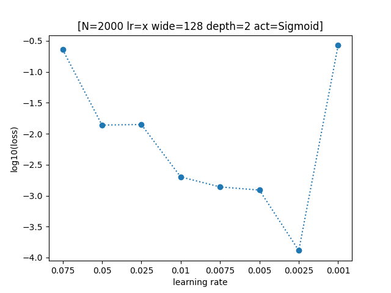
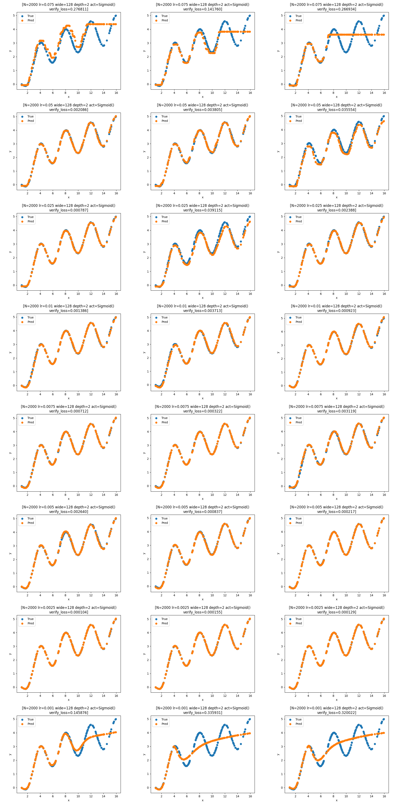
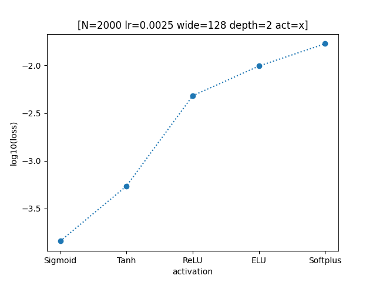
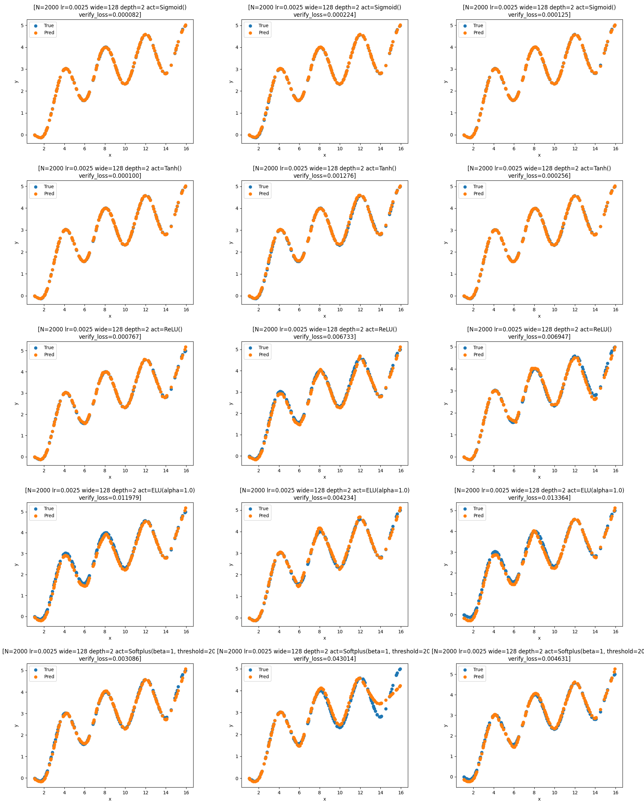
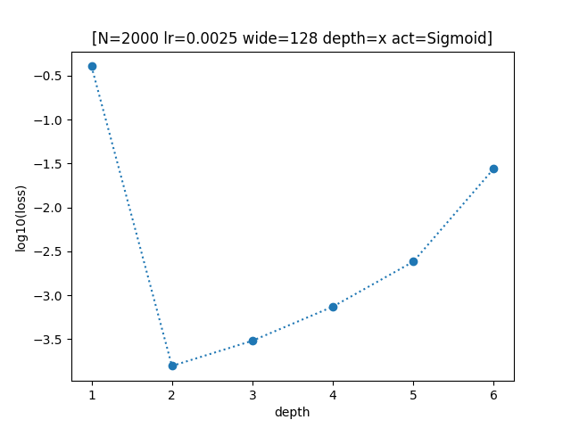
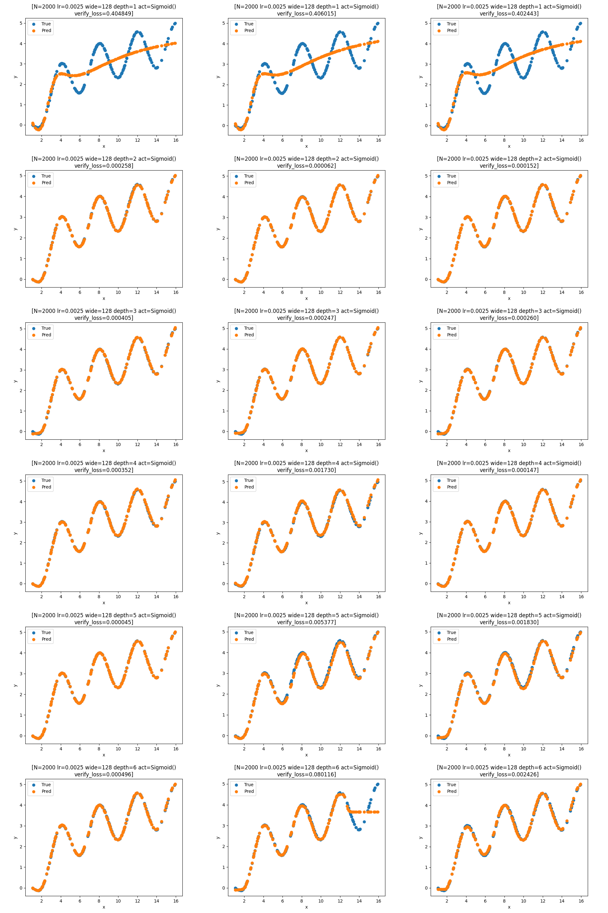
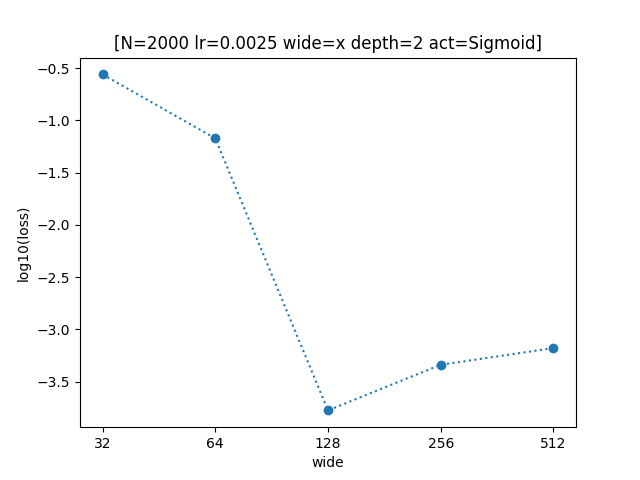
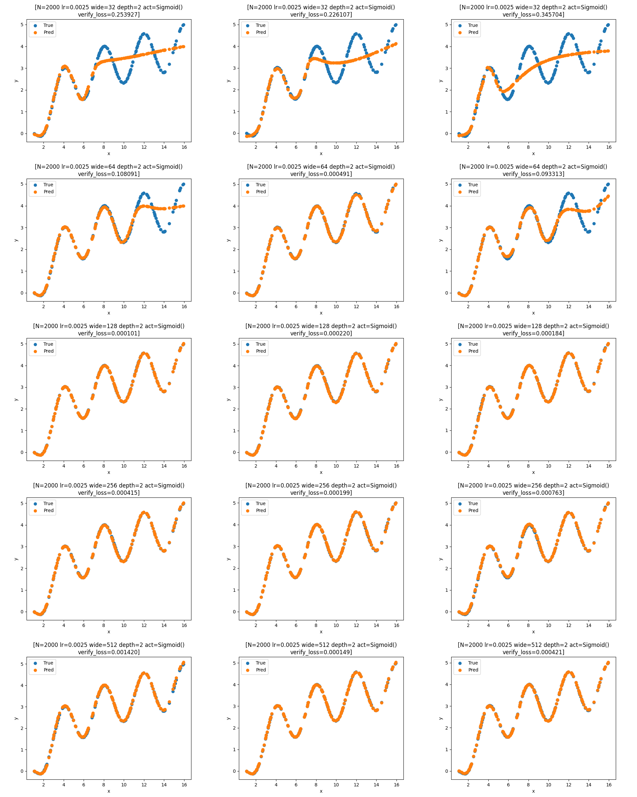
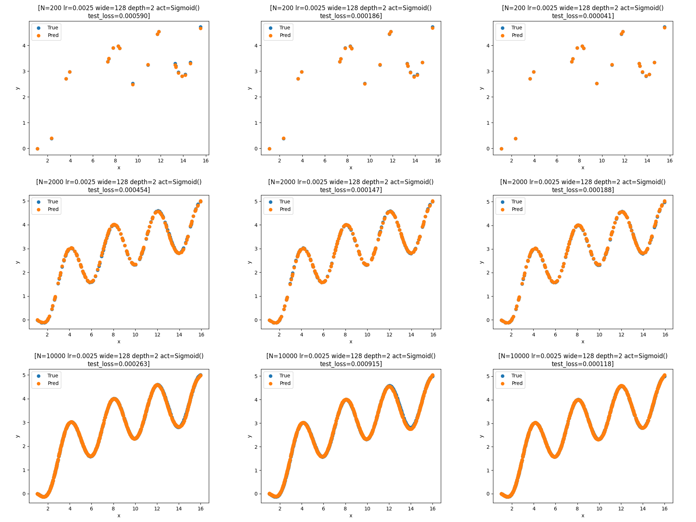

## **【Report】前馈神经网络FNN**

==肖羿 PB21010452==

### **【概述】**

Python基于Pytorch库实现前馈神经网络，近似函数 $f(x)=\log_2{x}+\cos(\frac{\pi x}{2}),x\in[1,16]$ 。

### **【代码结构】**

#### **1.【main.py】**

```python
#————[模型搭建]————#
class FNN(nn.Module):
    def __init__(self,wide:list,act): #wide储存每层节点数
    def forward(self,x):
```

```python
#————[生成数据集]————#
numpy.random.seed(233) #自定义随机数以固定数据集
# 按照 训练集：验证集：测试集=8：1：1 对数据集进行随机划分
...
```

对比实验后选择参数如下：

```python
#————[参数]————#
_N=2000 #数据集总量
_lr=0.0025 #学习率
_wide=128 #网络宽度(隐藏层每层节点数量)
_depth=2 #网络深度(隐藏层数量)
_act=nn.Sigmoid() #激活函数类型(Sigmoid,Tanh,ReLU,ELU,Softplus)
```

由于训练出的模型性能有波动，进行三次重复实验取平均值。

当数据量较小时，配合使用更大的 $\text{epochs}$ 以进行充分训练。

```python
_times=3 #重复实验次数
loss_=[] #网络性能（利用均方误差损失函数，计算预测值与真实值之间的损失）
for T in range(_times):
    #————[模型搭建]————#
    model=FNN(wide=[1,*[_wide]*_depth,1],act=_act) #使用FNN模型
    criterion=nn.MSELoss() #均方误差损失函数
    optimizer=torch.optim.Adam(model.parameters(),lr=_lr) #Adam优化器

    #————[模型训练]————#
    _epochs=round(75*10000/_N) #总训练次数（数据集较小时增加次数）
    _batch_size=64 #训练集分批大小 
    ...
    
    #————[调参分析/数据测试]————#
    ...
    loss_.append(...)

#计算网络性能平均值
loss_average=...
```

#### **2.【plots.py】**

将验证集上调参对比所得数据绘制图表。纵坐标使用损失值 $loss$ 以 $10$ 为底的对数值。

<div STYLE="page-break-after: always;"></div>
### **【参数对比】**

#### **1.【学习率 learning rate】**

固定其他参数，分别取 $lr=0.075,0.05,0.025,0.01,0.0075,0.005,0.0025,0.001$ 进行测试，每组参数取三次重复试验 $loss$ 平均值。

学习率过高或过低效果都不佳。且学习率越低，收敛速度越慢，需要越大的训练次数加以配合，容易出现训练不充分的问题。






<div STYLE="page-break-after: always;"></div>
#### **2.【激活函数 activation】**

固定其他参数，分别尝试 $\text{Sigmoid,Tanh,ReLU,ELU,Softplus}$ 五种激活函数，每组参数取三次重复试验 $loss$ 平均值。

$\text{Sigmoid}$ 性能最优，$\text{Tanh}$ 比之略差。剩余三者大约为同一量级（性能波动较大，且 $\text{Softplus}$ 有时会收敛失败），且存在输出函数不光滑的问题。





<div STYLE="page-break-after: always;"></div>
#### **3.【网络深度 depth】**

固定其他参数，分别取 $depth=1,2,3,4,5,6$ 进行测试，每组参数取三次重复试验 $loss$ 平均值。

深度较小时泛化能力差，无法近似复杂函数。

深度较大时难以优化，存在梯度消失的问题，且时间复杂度大幅上升。

随着深度的增大，较小值处的偏差更加明显，可能是深层次网络放大了 $\text{Sigmoid}$ 函数较小值处梯度过大的问题。





<div STYLE="page-break-after: always;"></div>
#### **4.【网络宽度 width】**

固定其他参数，分别取 $width=32,64,128,256,512$ 进行测试，每组参数取三次重复试验 $loss$ 平均值。

宽度较小时，模型泛化能力差。增大到一定量级后饱和，不再有明显提升，甚至可能变差。





<div STYLE="page-break-after: always;"></div>
### **【测试】**

在三种大小的测试集上重复试验三次，最终损失值 $loss$ 大约为 $10^{-4}$ 上下。



### **【问题】**

- 网络性能波动大，时好时坏影响判断，应该增加重复实验次数。
