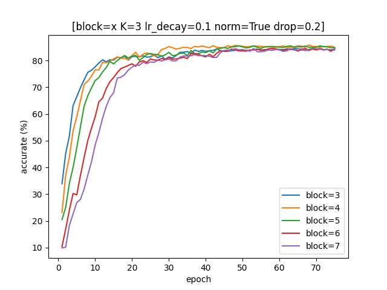
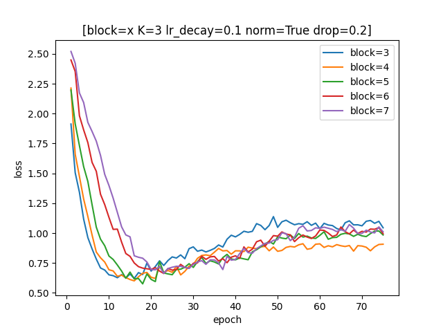
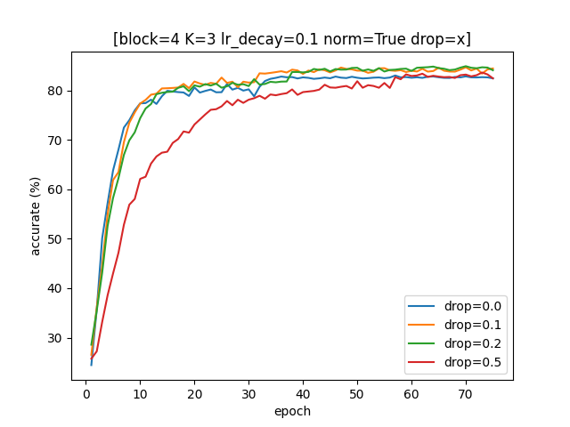
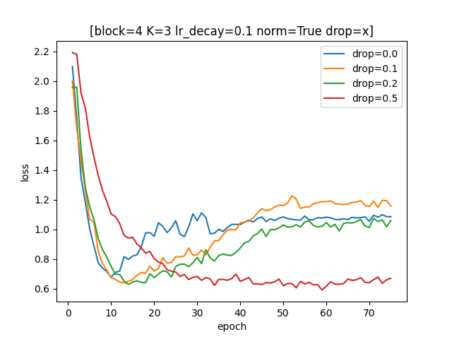
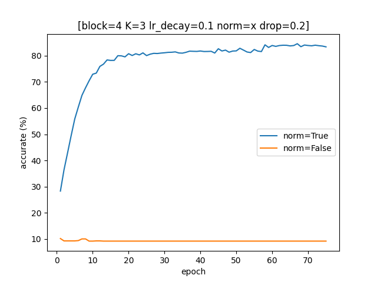
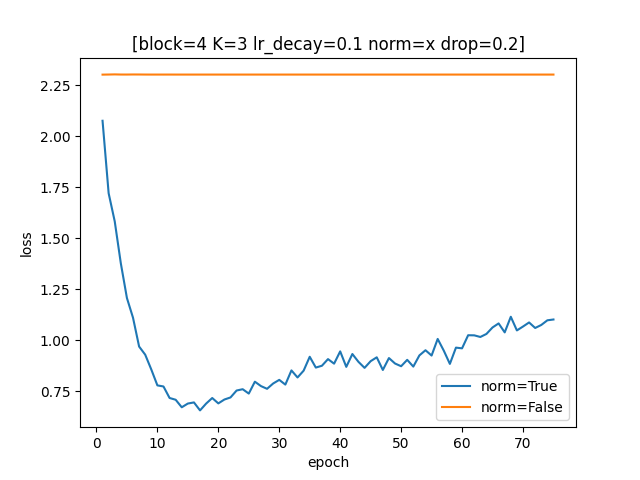
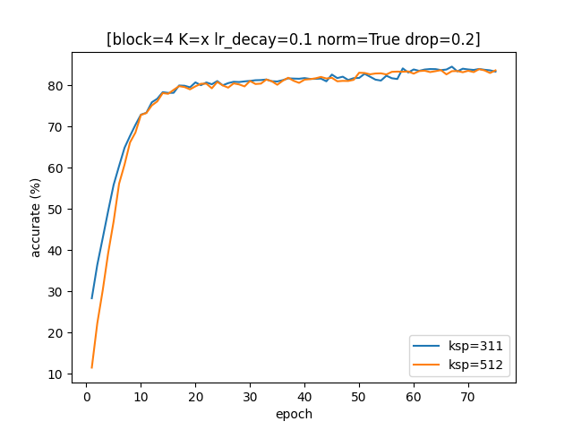
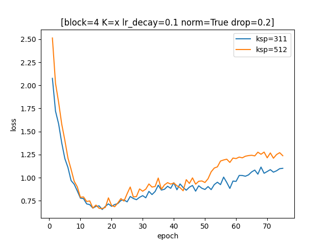
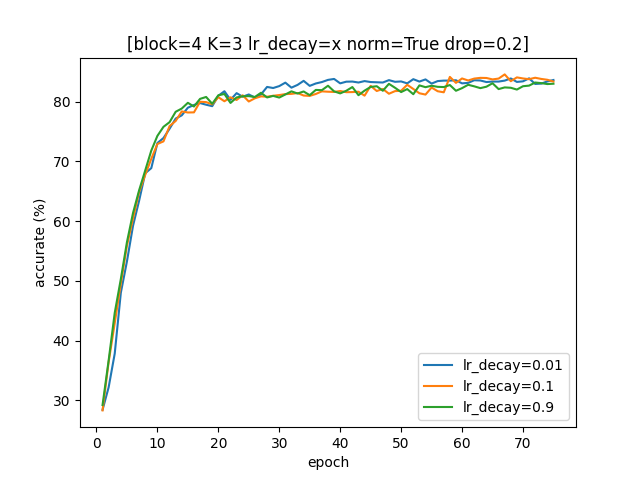
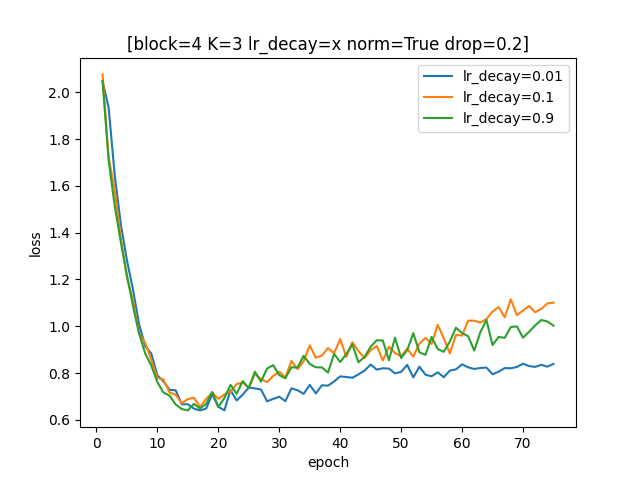

## **【Report】卷积神经网络CNN**

### **【概述】**

Python 基于 Pytorch 库实现卷积神经网络，在 *CIFAR-10 数据集* 上进行图片分类。

### **【代码结构】**

#### **1.【main.py】**

```python
#————[模型搭建]————#
# 卷积块
class CNN_block(nn.Module):
    def __init__(self,inputs,outputs,K,S,P,norm=True,drop=0.2,pool=True):
        # kerner_size 卷积核的尺寸 F
        # stride 卷积步长 S
        # padding 增加0边的层数 P
        self.block=nn.Sequential(
            Conv2d... #通道数改变
            BatchNorm2d......
            Dropout...
            ReLU...
            Conv2d... #通道数不变
            BatchNorm2d......
            Dropout...
            ReLU...
            MaxPool2d...
        )
    def forward(self,x):

class CNN(nn.Module): #VGG结构
    def __init__(self,output,K=3,S=1,P=1,norm=False,drop=0.2,blocks=3): #block储存每个卷积块大小
        # 输入块（1个参数层）
        self.conv1=nn.Sequential(
            Conv2d... #通道数变为64
            BatchNorm2d...
            ReLU...
            MaxPool2d... #像素折半
        )
        
        # 卷积块 3+ 个（blocks*2个参数层）
        # 每块 2 个卷积层、0/1个汇聚层
        self.block1=CNN_block... #通道数翻倍，像素折半
        self.block2=CNN_block... #通道数翻倍，像素折半
        self.block3=CNN_block... #通道数翻倍，像素折半
        
        self.add_blocks=blocks-3 #额外卷积块个数
        self.block_=CNN_block... #通道数不变，像素不变
        
        # 全连接块 1 个（1个参数层）
        self.fc=nn.Sequential(
            nn.Linear...
            nn.BatchNorm1d...
            nn.Dropout...
            nn.ReLU...
        )

        # 输出块（1个参数层）
        self.fc_out=nn.Linear...
        
    def forward(self,x):
```

```python
#————[生成数据集]————#
#在50000个训练集中随机选取5000个作为验证集
...
```

对比实验后选择参数如下：

```python
#————[参数]————#
_N=50000 #训练集总量
_N_verify=5000 #验证集总量
_N_test=10000 #测试集总量
_picsize=(32,32) #输入图像大小
_label_type=10 #输出标签种类

_lr_st=0.01 #初始学习率
_lr_ed=0.00001 #学习率下限
_lr_decay=0.01 #学习率递减速度 0.01 0.1 0.9

_blocks=3+1 #卷积块个数（4个:9层、5个:11层、6个:13层、7个:15层...）
_ksp=[3,1,1] #[k,s,p]=[3,1,1] [5,1,2] [7,1,3]

_drop=0.2 #dropout概率
_norm=True #是否实用标准化层
```

```python
#————[模型搭建]————#
model=CNN(output=_label_type,K=_ksp[0],S=_ksp[1],P=_ksp[2],norm=_norm,drop=_drop,blocks=_blocks) #使用CNN模型
criterion=nn.CrossEntropyLoss() #交叉熵损失函数
optimizer=torch.optim.Adam(model.parameters(),lr=_lr_st) #Adam优化器
scheduler=torch.optim.lr_scheduler.ReduceLROnPlateau(optimizer,
    mode='max', #监测accurate指标
    factor=_lr_decay, #学习率下降速度
    patience=5, #能忍受多少个epoch指标不变
    threshold=0.0001, #判断指标变化的依据
    min_lr=_lr_ed) #学习率下限

#————[模型训练]————#
_epochs=75 #总训练次数
_batch_size=256 #训练集分批大小 
...

#————[调参分析]————#
...

#————[调参分析]————#
...


```

#### **2.【data.py】**

将验证集上调参对比所得数据绘制图表。纵坐标分别使用准确度 $\text{acc}$ 和损失值 $\text{loss}$ 。

<div STYLE="page-break-after: always;"></div>
### **【参数对比】**

#### **1.【网络深度 blocks】**

固定其他参数，分别取卷积块个数 $\text{blocks}=3,4,5,6,7$（分别对应 $9,11,13,15,17$ 个参数层）进行测试。

随着深度的增加，网络更难优化，收敛速度变慢，但网络性能并没有得到太多提升，甚至略微下降。






<div STYLE="page-break-after: always;"></div>
#### **2.【dropout概率 drop】**

固定其他参数，分别尝试 $0.0,0.1,0.,0.5$ 四种 $\text{dropout}$ 概率进行测试。

不使用 $\text{dropout}$ 或者概率太小容易过拟合，$\text{dropout}$ 概率太大需要配合更多的训练轮次以达到收敛。





<div STYLE="page-break-after: always;"></div>
#### **3.【标准化 normalization】**

固定其他参数，分别取对使用/不使用 $\text{normalization}$ 进行测试。

不加标准化层，模型学不到任何东西。

深度较大时难以优化，存在梯度消失的问题，且时间复杂度大幅上升。

随着深度的增大，较小值处的偏差更加明显，可能是深层次网络放大了 $\text{Sigmoid}$ 函数较小值处梯度过大的问题。





<div STYLE="page-break-after: always;"></div>
#### **4.【卷积核大小 kerner_size】**

固定其他参数，分别取卷积核大小 $\text{kerner_size}$ 、步长 $\text{stride}$、增加0边的层数 $\text{padding}$ 为 $[3,1,1],\ [5,1,2]$ 进行测试。

宽单独增加卷积核大小对性能没有太大影响，略微增加过拟合的风险，运行时间复杂度大幅上升。





<div STYLE="page-break-after: always;"></div>
#### **5.【学习率递减速度 learning rate decay】**

固定其他参数，分别取学习率递减速度 $\text{lr_decay}=0.01,0.1,0.9$ 进行测试。

刚开始训练时，使用较大学习率能快速提升性能，而接近收敛范围时震荡范围较大，此时调整至较小学习率更易收敛，并在一定程度上减弱过拟合的问题。





<div STYLE="page-break-after: always;"></div>
### **【测试】**

在训练中增加早停判断，若准确率超过十轮无变化则提前停止训练。

最终测试结果（第 $59$ 轮停止）：损失值  $\text{loss=0.815757}$，准确率 $\text{acc=83.58}\%$ 。

### **【问题】**

- 网络结构太复杂，容易过拟合。
